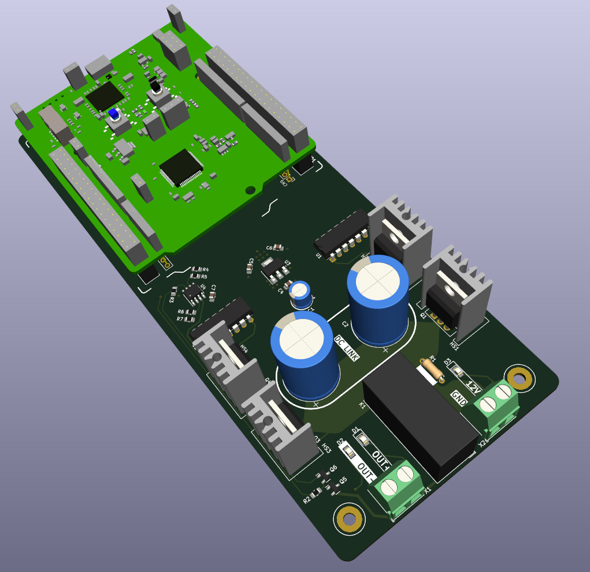
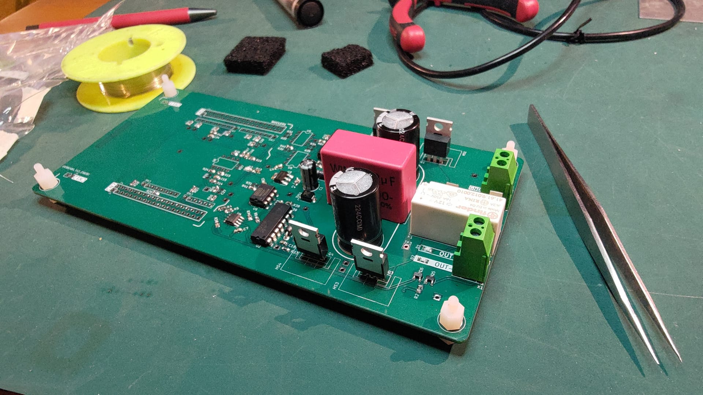
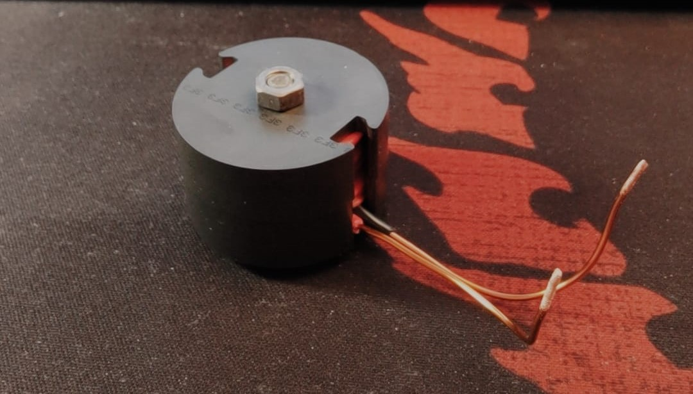
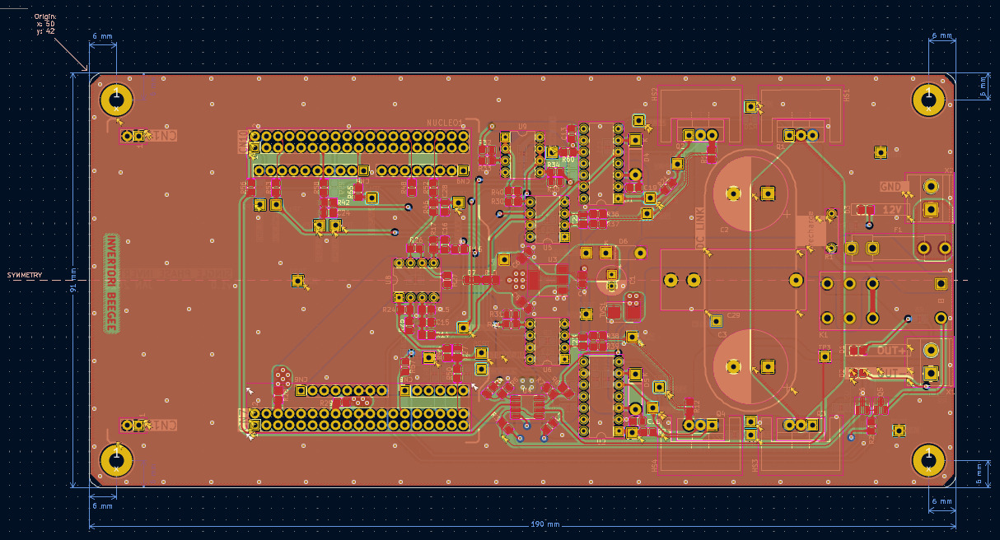

# singlePhaseInverter
*Precursor project to a future three-phase inverter for driving synchronous motors. This project is a work in progress.*

## Purpose
This project is aimed to provide experience a rounded engineering exercise. It blends hardware development for power electronics with inverter control algorithms and time-sensitive embedded software on which the algorithm runs.
After the single-phase inverter is reliable operating with a control loop, a new 3-phase inverter project will be started, with an ultimate goal of reducing inverter conduction and switching losses.

## Description
A low-voltage, single phase inverter system, controlled by an STM32 G431 microcontroller. The PCB, algorithm, and control software are self-developed but based on existing design practices. The inverter contains 4 power switching transistors, an array of DC link capacitors, four gate drivers, a precharge function for the DC link, two current measurment shunts, and one hall current sensor. The design purposely uses:
- multiple large capacitors to allow for trying out various capacitor types and values;
- multiple current sensing types to allow experimenting with each approach
- multiple different shunt amplifier types, again for experimenting purposes
- low voltage, for safety reasons
- through-hole transistors with a large thermal overhead
All of these choices were made primarily to simplify the development of the control algorithm, and with locally available components. After a stable algorithm is established, a new version of hardware can be developed to optimize DC link size and type, transistor size, gate driver selection, current and voltage measurement, and overall BOM cost.
The inverter is purposly made low-voltage, primarily for safety reasons, but also to lower costs and save time on isolation coordination.

## Overview
- Discrete H-bridge circuit
- Serial port debugging
- Variable frequency control

## Project status
Currently the project performs fixed frequency PWM control of the transistors at a very low switching frequency of 10kHz - this is done to minimize complications that arise from higher switching frequencies. The output waveform frequency is 60Hz. Due to such a low switching frequency, in order to keep the current low, the output is loaded with a large, custom-made 22mH inductor for smoothing the waveform. Currently the issue is for very small and very large pulse widths, the gate driver cannot properly drive the switching transistors.

## System architecture

### Microcontroller
The system is based on an STM32 G431 microcontroller. In this first version of the hardware, a NUCLEO development board is used for the actual MCU implementation, to save on development time. The output of the MCU are four PWM signals, one for driving each transistor, generated in the MCU's internal timers, and include a 1% dead-time between complementary signals. The MCU also controls the precharge.
### H-bridge
The inverter in this phase uses four IRF540N transistors. These transistors are much larger than necessary, and no heat sink is needed. The transistors are driven by two IR2113 gate drivers. The DC link capacitor currently in use is oversized, and will be optimized in a future version.
### Current and voltage measurement
The DC voltage, as well as the both AC outputs are measured through resistor deviders. The current is measured in multiple locations, and the optimal current sensor will be chosen. A shunt resistor is located on the source of the low-side transistor on each H-bridge branch. The small voltage across the shunt is amplified to a MCU-readable via an instrumentation amplifier. Two different instrumentation amplifiers are used for each shunt resistor, and the more appropriate one will be chosen to be implemented on both shunts. They are pin-compatible. The current is also measured on one of the output lines (in theory, only this current is needed for control).
### Precharge
Precharge is needed due to the large DC link capacitance. A single-pole, double throw relay is used for precharge. Without power or an active control signal, the relay connects the DC link voltage to the input DC voltage through a 100-ohm resistor. Once the DC link voltage reaches 90% of the input DC voltage, the relay switches to its other output, which directly connects the input and DC link potential. The entire inverter current passes through this relay.
### Control
The current status of the project implements a fixed PWM signal, where the pulse width for each period is read out of a pre-calculated lookup table. The final control algorithm will implement a simple PI controller. The controller is simulated in Simulink.
## Firmware
### Implemented features
- [x] PWM signal generated from predetermined lookup table
- [x] Serial interface debugging
- [x] Timer PWM and deatime control
- [x] Reliable analog current and voltage readings - _work in progress_
### Planned features
- [ ] PI controller implemented in firmware
- [ ] Real-time Pulse Width calculation

## Future improvements
Once the entire project is working reliable, more advanced features can be implemented:
- Soft start
- Dithering
